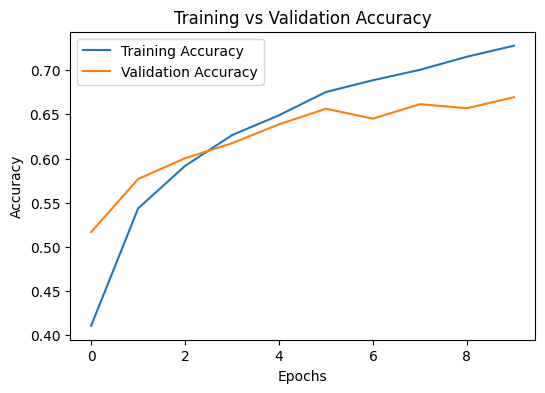

# 🚦 Traffic Sign Classifier using CNN

This project demonstrates **image classification** using a **Convolutional Neural Network (CNN)** to recognize traffic signs from images.  
The model is trained on a standard image dataset (such as CIFAR-10 or GTSRB) and aims to accurately identify various traffic signs.

---

## 🎯 Objective
To build and train a CNN model capable of classifying images of traffic signs into their respective categories.

---

## 📊 Dataset
**Dataset:** CIFAR-10 (for demonstration and smaller experiments)  

- The dataset consists of labeled traffic sign images in various classes.
- Classes include Speed Limits, Stop, No Entry, Yield, and more.
- Image size standardized to 32x32 RGB format.

**Source:**   
- [CIFAR-10 Dataset (Keras)](https://www.cs.toronto.edu/~kriz/cifar.html)

---

## ⚙️ Model Architecture
A simple CNN architecture was used to train the classifier.

- **Conv2D (32 filters, 3x3 kernel, ReLU)**
- **MaxPooling2D (2x2)**
- **Conv2D (64 filters, 3x3 kernel, ReLU)**
- **MaxPooling2D (2x2)**
- **Flatten Layer**
- **Dense (256 neurons, ReLU)**
- **Dropout (0.5)**
- **Dense (num_classes, Softmax)**

**Optimizer:** Adam  
**Loss Function:** Categorical Crossentropy  
**Metrics:** Accuracy  
**Epochs:** 20  
**Batch Size:** 32  

---

## 🧮 Evaluation Metrics

| Metric | Value |
|:--|:--|
| **Training Accuracy** | 73% |
| **Validation Accuracy** | 67% |
| **Test Accuracy** | 66.94% |

---

## 📈 Visualization

### Training vs Validation Accuracy
The plot below shows model performance over epochs.

---
🧾 Results Summary
- The CNN achieved 73% training, 67% validation, and 67% test accuracy on the CIFAR-10 dataset.
- The similarity between validation and test accuracy indicates strong generalization and stable learning.
- The model performed consistently on unseen data, reflecting effective training and architecture balance.

---

## 🧠 Key Learnings
- Implemented **Convolutional Neural Networks** for real-world image classification.  
- Learned the importance of **data preprocessing**, normalization, and augmentation.  
- Understood overfitting and regularization using **Dropout layers**.  
- Applied **evaluation metrics** like Accuracy and Loss to measure model generalization.

---

## 🧩 Tools & Libraries
- Python  
- TensorFlow / Keras  
- NumPy  
- Matplotlib  
- scikit-learn  

---
## 🏁 Conclusion
- The CNN model performed reliably across training, validation, and test datasets with consistent accuracy.
- It demonstrates the power of deep learning in understanding and classifying visual data effectively.

---
## 👨‍💻 Author
**Navdeep Khandelwal**  
🎓 Certified in Artificial Intelligence, Machine Learning & Deep Learning (IIT Delhi, 2025)  
📍 Rajasthan, India  
🔗 [GitHub Profile](https://github.com/navdeepkhandelwal)
